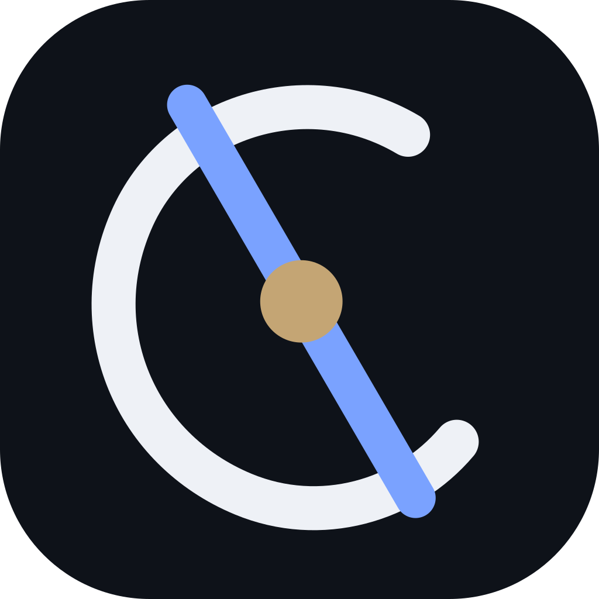

<p align="center">
  
</p>

# Veylora

Engineering partner for **AI × Blockchain × Fintech**.

This repository is the public website for [Veylora](https://veylora.network): a remote-first studio that designs and builds production-ready software at the intersection of AI, blockchain, and modern financial infrastructure.

Company introduction: [COMPANY.md](COMPANY.md)

[veylora.network](https://veylora.network) · [Start a project](https://veylora.network/contact) · [X](https://x.com/VeyloraNetwork) · [Telegram](https://t.me/Veylora_official)

## Mission

To design and build production-ready software at the intersection of AI, blockchain, and financial infrastructure—so ambitious companies can turn complex ideas into systems that ship, operate, and scale.

## Vision

A financial software landscape where intelligence is infrastructure: reliable, transparent, and accountable. The next generation of money products should be engineered with the same rigor as the institutions that depend on them.

## What this site covers

- Services: AI / ML, Blockchain / Web3, Fintech
- Solutions for financial platforms, lending, digital banking, payments, Web3, and AI SaaS
- Structured case-study examples (not named client work)
- About, mission, vision, and team
- Contact form and a site assistant

## Stack

- Next.js 16 and React 19
- TypeScript
- Tailwind CSS v4
- Framer Motion
- Lucide React

## Getting started

```bash
npm install
cp .env.example .env
npm run dev
```

Open [http://localhost:3000](http://localhost:3000).

```bash
npm run lint
npm run typecheck
npm run build
```

## Environment

Copy `.env.example` and fill in local values. Do not commit `.env`.

| Variable | Purpose |
| --- | --- |
| `NEXT_PUBLIC_SITE_URL` | Canonical site URL for metadata, sitemap, and robots |
| `GROQ_API_KEY` | Free site-assistant key ([Groq](https://console.groq.com)) |
| `OPENAI_MODEL` | Groq or OpenAI model id. Default: `openai/gpt-oss-20b` |
| `OPENAI_API_KEY` | Paid OpenAI alternative |
| `OPENAI_BASE_URL` | Optional custom OpenAI-compatible endpoint |

The assistant uses Groq when `GROQ_API_KEY` is set. Otherwise it uses OpenAI.

## Company copy

Brand name, email, location, mission, vision, and social links live in [`src/lib/site.ts`](src/lib/site.ts). Change that file to update the site-wide company profile.

## Routes

| Path | Page |
| --- | --- |
| `/` | Homepage |
| `/services` | Services overview |
| `/services/ai-ml` | AI / ML |
| `/services/blockchain-web3` | Blockchain / Web3 |
| `/services/fintech` | Fintech |
| `/solutions` | Solutions |
| `/case-studies` | Case studies |
| `/about` | About, mission, vision, team |
| `/contact` | Contact |

`POST /api/contact` validates project inquiries. Connect an email or CRM provider before using it in production.

`POST /api/chat` powers the floating site assistant.

## Contact

- Email: [career@veylora.network](mailto:career@veylora.network)
- Telegram: [t.me/Veylora_official](https://t.me/Veylora_official)
- Location: International · Remote-first · Europe · Asia · Americas
